## Development Fund Proposal

**Organization:** Talwex Inc.

**Author / Primary Contact:** André Dibé (CEO/Founder, Talwex Inc.) & Arno Burnuk (CTO, Talwex Inc.)

**Status:** Submitted

**Created:** 2026-08-03

**Proposal Type:** RFP-aligned

**RFP / Roadmap Area:** Payments and DeFi (#13); RWA Standards (12)

**Champion:** @akshaysinha100 (Alpend)

**Total Funding Request:** 3,600,000 CC

**Project Duration:** 8 months

**Label:** token-asset-standards

---

## Abstract

This proposal funds the design, specification, and open-source reference implementation of two Canton Improvement Proposals:

- **CIP-TBD-A: Canton Tokenized Vault Standard** (`Vault` / `VaultShare`) — the Canton equivalent of ERC-4626, defining a canonical interface and a reference implementation (`SimpleVault`) for single-asset tokenized vaults on Canton built on top of daml-finance. `VaultShare` is CIP-112 compliant.
- **CIP-TBD-B: Canton DeFi Composability Interfaces** (`Pricing` / `Swap` / `Oracle`) — a set of composable primitives enabling swap routing and price quoting across any compliant Canton DeFi protocol.

Together these two CIPs establish the core composability stack for DeFi on Canton: any yield protocol or liquidity router that accepts a `ContractId Vault` or `ContractId Swap` can work with any compliant vault or swap venue without bespoke adapters.

At Talwex, we are building the future infrastructure for bonds. We intend to build a bond AMM that will serve as the foundation of our off-chain bond ATS, ie. the Nasdaq for bonds. 

As a first step, we feel this proposal will provide the building blocks needed for not only our own AMM but other DeFi products. Thereby, we forsee our stack stimulating the emergence of a robust DeFi ecosystem similar to that on EVM chains.

---

## Specification

### 1. Objective

Deliver two open CIPs with full interface specifications and naive reference implementations:

1. **CIP-TBD-A** — `Vault` + `VaultShare`: canonical single-asset vault, replicating ERC-4626, with CIP-112 compliant LP share token, deposit/withdraw/mint/redeem lifecycle, accounting choices, and extension hooks.
2. **CIP-TBD-B** — `Pricing` + `Swap` + `Oracle`: composability layer enabling swap routing, executable price quoting, and standardised oracle delivery — decoupled from any specific pool implementation.

---

### 2. Implementation Mechanics

#### CIP-TBD-A: Vault Standard

The vault standard defines two Daml interfaces:

**`VaultShare requires CIP-112 Fungible`** — a CIP-112 compliant instrument representing a proportional claim on vault reserves. Issued exclusively by a compliant `Vault`. Transferable and splittable via daml-finance `Fungible` / `Transferable`. The `VaultShareView` carries `issuerVaultOperator`, `assetKey`, and `version`.

**`Vault`** — the vault interface. All compliant vaults implement this. Key design decisions aligned with ERC-4626:

- Defines a `unitOfAccount : InstrumentKey` — the denomination used for `TotalAssets` and share pricing. Single-asset vaults (e.g. `SimpleVault`) set this to their one reserve asset; multi-asset vaults set it to their settlement asset and value all reserves in that denomination
- Issues `VaultShare` holdings to depositors representing proportional reserves
- Reserves are held as daml-finance `Holding` contracts (`reserveHoldingCid` — private, not projected into `VaultView`)
- `Deposit` / `Mint` / `Withdraw` / `Redeem` are consuming choices; accounting choices (`TotalAssets`, `ConvertToShares`, `ConvertToAssets`, `Preview*`, `Max*`) are nonconsuming
- Rounding always favours the vault (rounds down on shares issued, rounds up on shares burned)
- `suspended = True` blocks `Deposit`/`Mint` but MUST NOT block `Withdraw`/`Redeem` — LPs can always exit
- Asset and share `Holding` inputs are validated on-chain (instrumentKey + accountKey.owner) before use

The reference implementation is `SimpleVault` — a single template implementing `Vault` with an `observers : Map Text (Set Party)` for Canton privacy management.

#### CIP-TBD-B: DeFi Composability Interfaces

This CIP defines three Daml interfaces that enable composability across Canton DeFi protocols. Two of them, pricing and swap, are flat with no `requires` relationships, so they can be adopted independently or composed freely.

**`Pricing`** — nonconsuming only. Exposes `GetSpotPrice : (baseAsset, quoteAsset) → Decimal` and `CalculateSwapOutput : (amountIn, tokenIn, tokenOut) → (amountOut, feePaid)`. All choices are nonconsuming so a template implementing both `Pricing` and `Swap` can call `GetSpotPrice` on `self` from within the `Swap` choice body without archiving the contract. Implementations range from pure curve-math engines (`ConstantProduct`, `StableSwap`) to oracle-backed price feeds — oracle delivery is an implementation detail, not a dependency of the interface.

CIP-TBD-B also defines an **`Oracle`** interface to standardise how external price sources plug into the `Pricing` surface, covering both push and pull delivery models. The reference implementation is **`PushOracle`**: the operator submits `UpdatePrice` commands on a schedule, each archiving and recreating the contract with the new price; the ATS tracks the current `ContractId`. A staleness threshold is enforced inside the `Pricing` choices — reads on an outdated contract are rejected on-chain, requiring no staleness logic in swap venues.

**`Swap`** — standalone (no `requires`). Exposes a **nonconsuming** `Swap` choice: the caller passes a CIP-112 compliant asset-in `Holding`, a `ContractId Pricing` for this execution, and a `minAmountOut` slippage guard, and receives a CIP-112 compliant asset-out `Holding` in `SwapResult`. The pricing contract may implement a curve-based model such as `SimplePricing`, an oracle-backed model such as `PushOracle`, or another approved pricing mechanism. The price and resulting amount are read or calculated on-chain from the caller-supplied pricing contract; the price value itself is never caller-supplied. Implementations must validate that the pricing contract is approved and, where it relies on an oracle, that the oracle is signed by a party in the venue's approved oracle set. The consuming work happens on the asset Holdings directly; the venue contract is not archived on each swap. Decoupled from `Vault` so non-vault swap venues (`RFQDesk`, `WrappedConverter`, order books) can implement it and be routed by any Canton router accepting `ContractId Swap`.

This CIP delivers `SimplePricing` (CPMM), `SimpleSwap` (Uniswap V2-style), and `PushOracle` as reference implementations alongside the interface specifications.

---

### 3. Architectural Alignment

- Builds directly on `daml-finance` V3/V4 `Holding`, `Fungible`, `Transferable`, and `Instrument` interfaces — no forks, no parallel standards
- CIP-TBD-A is the Canton equivalent of ERC-4626; CIP-TBD-B is the Canton equivalent of the Uniswap V2 pool and pricing interfaces (the router pattern is the downstream use case enabled by `ContractId Swap`)
- `Vault`, `Pricing`, and `Swap` carry no `requires` relationships between each other — they can be adopted independently and composed freely; `Oracle` carries a `requires Pricing` relationship so every Oracle implementation is also a valid `ContractId Pricing`, enabling oracle-backed venues to implement a single contract without glue code
- Compatible with Canton's explicit disclosure model: traders interact via `Swap` without being permanent observers of the pool contract; they receive it only for their transaction

### 4. Backward Compatibility

Our stack builds on daml 3.x, daml-finance V3/V4, and LF 2.2, and CIP-112, which the ecosystem is quickly converging towards.

Using CIP-112 as the base token standard, our stack is compatible with the wider ecosystem as well as backward compatible with CIP-56.

The proposed interfaces do not introduce a competing asset or holding model. Vault reserves, vault shares, and swap inputs and outputs remain standard daml-finance `Holding` contracts, and `VaultShare` follows the CIP-112 fungible-token model. Existing applications that already consume CIP-112 assets can therefore integrate with a compliant vault or swap venue through the published interfaces without changing their underlying asset custody or transfer logic.

Compatibility with CIP-56 is preserved at the asset boundary: CIP-56-compliant tokens can continue to be held and transferred through the underlying daml-finance interfaces, while CIP-112 provides the canonical interface for new integrations. Where an existing application exposes an older or application-specific contract shape, a thin adapter can translate its deposit, redemption, pricing, or swap calls into the standard interfaces without requiring migration of the underlying holdings. This keeps adoption incremental and allows existing Canton protocols to implement the interfaces alongside their current APIs.

---

## Milestones and Deliverables

### Milestone 1: Canton Tokenized Vault Standard (CIP-TBD-A)

- **Estimated Delivery:** 12 weeks from grant approval *(target: Jan 01, 2027)*
- **Focus:** Ratified interface specification + reference implementation for `Vault` and `VaultShare`
- **Deliverables / Value Metrics:**
  - Published CIP-TBD-A specification document (interface definitions, rounding rules, security considerations, Canton deviation notes vs ERC-4626)
  - `Vault` and `VaultShare` Daml interface source in open-source repository
  - `SimpleVault` reference template implementing `Vault` with full deposit/withdraw/mint/redeem lifecycle against a daml-finance `Holding` reserve
  - `VaultShare` instrument template implementing `VaultShare` + CIP-112 Fungible
  - Daml Script integration tests covering: deposit → share issuance, withdraw → share burn, suspend blocks deposit but not withdraw, rounding invariants, double-spend prevention
  - **Ecosystem value metric:** CIP-TBD-A submitted to Canton CIP process; at least 1 external Canton team confirms intent to implement `Vault` against their existing vault logic

### Milestone 2: DeFi Composability Interfaces (CIP-TBD-B)

- **Estimated Delivery:** 12 weeks after Milestone 1 *(target: 01 April, 2027)*
- **Focus:** Ratified interface specifications for `Pricing`, `Swap`, and `Oracle` — with interface and naive implementation for each.
- **Deliverables / Value Metrics:**
  - Published CIP-TBD-B specification document covering `Pricing`, `Swap`, `Oracle`, canonical return records (`SwapResult`), composability patterns, and price feed delivery guidance
  - `Pricing`, `Swap`, and `Oracle` Daml interface source in open-source repository
  - `SimplePricing` reference `Pricing` implementation — Constant Product Market Maker (`x * y = k`)
  - `SimpleSwap` reference `Swap` implementation — Uniswap V2-style atomic swap using `SimplePricing` as its curve
  - `PushOracle` reference `Oracle` implementation — push-pattern feed with on-chain staleness guard; serves as the `pricingCid` in `SimpleSwap` integration tests
  - Price feed integration guide covering push, pull, and Kaiko request-response patterns with example Daml Script workflows for each
  - End-to-end composability demo: Daml Script showing a Canton router exercising `ContractId Swap` across two different venue implementations
  - Daml Script integration tests covering: swap exact in / exact out, slippage guard, oracle staleness rejection, `ContractId Swap` router composability pattern
  - **Ecosystem value metric:** CIP-TBD-B submitted to Canton CIP process; at least 1 Canton swap venue confirms intent to adopt `Swap` against their existing implementation

### Milestone 3: Audit, Remediation, and Final Release

- **Estimated Delivery:** 8 weeks after Milestone 2 *(target: 01 June, 2027)*
- **Focus:** Independent security review of all CIPs and reference contracts, remediation of findings, and final package release
- **Deliverables / Value Metrics:**
  - Independent security audit of `Vault`, `VaultShare`, `SimpleVault`, `Pricing`, `Swap`, `Oracle`, `SimplePricing`, `SimpleSwap`, and `PushOracle` by a qualified Daml/smart contract auditor
  - Public remediation report addressing all audit findings with severity classification and fix documentation
  - Final test suite: aiming for 100% Daml Script choice coverage across both CIPs; adversarial test cases for all OWASP-equivalent vectors (re-entrancy equivalent via choice chaining, holding ownership spoofing, oracle manipulation, rounding exploit attempts)
  - Final published versions of CIP-TBD-A and CIP-TBD-B incorporating audit-driven amendments
  - **Ecosystem value metric:** Audit report published openly; zero unresolved High or Critical findings at release; package available on Canton package registry for direct dependency by any Canton project

---

## Acceptance Criteria

The Tech & Ops Committee will evaluate completion based on:

- CIP-TBD-A and CIP-TBD-B specifications published and submitted to the Canton CIP process
- All reference implementations compile and pass all Daml Script tests on SDK 2.10.0+
- All Milestone 3 audit findings at High or Critical severity resolved before final release
- Price feed integration guide covers all three delivery patterns (push, pull, request-response) with working Daml Script examples
- At least 2 external Canton ecosystem teams confirm adoption intent against the published interfaces
- Milestone 2 accepted before Milestone 3 commences (audit scope frozen at M2 output)

---

## Funding

**Total Funding Request:** 3,600,000 CC (~$300,000 USD at $0.12/CC — rate to be confirmed against Canton Dev Fund published rate at submission)

### Payment Breakdown by Milestone

- Milestone 1 — Vault Standard (~40%): 1,440,000 CC upon committee acceptance of CIP-TBD-A and `SimpleVault` test passage
- Milestone 2 — DeFi Composability Interfaces (~40%): 1,440,000 CC upon committee acceptance of CIP-TBD-B and composability demo
- Milestone 3 — Audit & Remediation (~20%): 720,000 CC upon publication of clean audit report and final package release

### Volatility Stipulation

Project duration is estimated at **32 weeks (8 months)**, falling within the fixed-denomination threshold. The grant is denominated in fixed Canton Coin. Should Committee-requested scope changes extend the timeline beyond 8 months, remaining milestone payments will be renegotiated to account for USD/CC price volatility.

---

## Co-Marketing

Upon release, Talwex Inc. will collaborate with the Foundation on:

- Joint announcement of CIP-TBD-A and CIP-TBD-B ratification
- Technical blog post: "Building DeFi on Canton: The Vault and Composability Stack"
- Developer workshop or office hours session demonstrating `SimpleVault` and `Swap` composability patterns live on DevNet
- Submission of `Vault`, `Pricing`, and `Swap` as reference interfaces to the Canton developer documentation

---

## Motivation

Canton's `daml-finance` library provides strong foundations for instrument and holding modelling but has **no standard vault or AMM primitive**. Every Canton team building a liquidity application today solves deposit/withdraw/share-accounting and pricing logic from scratch, producing incompatible bespoke implementations.

Without a standard:
- Cross-protocol composability is impossible — a lending protocol cannot generically accept collateral from any vault type
- Liquidity is fragmented — each deployment is an island
- Audit surface is multiplied — every team re-implements the same rounding, suspension, and oracle-staleness logic independently

ERC-4626 on Ethereum solved the same problem in 2022. Within 18 months of its ratification, 50+ protocols adopted it, and it became the default composability primitive for all yield-bearing assets in the EVM ecosystem. This proposal delivers the Canton equivalent, adapted for daml-finance's `Holding`-based asset model and Canton's privacy-preserving ledger semantics.

An estimated 80% of Canton DeFi applications require a vault or liquidity pool primitive. This standard reduces the integration surface for all of them to a single, audited interface.

We plan at Talwex to use these primitives to build our proprietary Bond AMM. In addition, as seen in the ecosystem diagram attached below, other teams in the ecosystem can build other DeFi products like RFQ systems, index vaults...

### Canton DeFi Composability Tree

The diagram below shows the full product space enabled by the two CIPs across four layers: the daml-finance foundation, the core interfaces, primitive implementations, and composed DeFi products.

```mermaid
flowchart TD
    subgraph L0["Layer 0 · daml-finance Foundation  (pre-existing)"]
        HLD["Holding\nContractId — transferable on-ledger asset"]
    end

    subgraph L1["Layer 1 · Core Interfaces  (CIP-TBD-A + CIP-TBD-B)"]
        IV["Vault  ·  CIP-TBD-A\nprimary market — issuance & redemption\nmints / burns Holdings  ·  consuming"]
        IS["Swap  ·  CIP-TBD-B\nsecondary market — transfers existing Holdings\nnonconsuming venue · consuming Holdings"]
        IP["Pricing  ·  CIP-TBD-B\nprice calculation & output quoting\nnonconsuming — safe to call on self"]
        IO["Oracle  ·  CIP-TBD-B\nstandardised price feed delivery\npush & pull models  ·  requires Pricing"]
    end

    HLD --> IV & IS & IP
    IP --> IO

    subgraph L2["Layer 2 · Primitive Implementations"]
        SV["SimpleVault\nVault\nsingle-asset yield vault / liquid staking"]
        IX["IndexVault\nVault\nNAV vault · basket of instruments or VaultShares · calls external Pricing + Swap"]
        CP["ConstantProduct\nPricing\nx · y = k  (Uniswap V2 curve)"]
        SS["StableSwap\nPricing\nCurve Finance invariant"]
        WM["WeightedMean\nPricing\nBalancer-style weighted pool"]
        OP["OraclePriced\nPricing\noracle-backed · delegates to external feed"]
        PU["PushOracle\nOracle + Pricing\nstreaming feed (Bloomberg, Refinitiv) · reference impl"]
        PL["PullOracle\nPricing\ncached on-ledger price contract"]
        RR["RequestResponse\nPricing\nKaiko / Pyth on-demand query"]
        RFQ["RFQDesk\nSwap + Pricing\nMM quotes from own inventory · no LP"]
        WC["WrappedConverter\nSwap + Pricing\n1:1 fixed-rate pricing"]
        AMM["AmmPool\nVault + Pricing + Swap\ntwo-sided marketplace with LP shares"]
    end

    IV --> SV & IX
    IP --> CP & SS & WM & OP
    IO --> PU & PL & RR
    IS & IP --> RFQ
    IS --> WC
    IV & IP & IS --> AMM

    subgraph L3["Layer 3 · DeFi Products"]
        subgraph AMM_P["AMM Products"]
            BV["Talwex Bond Vault\nAmmPool\nsingle-sided LP · oracle NAV pricing\nprimary + secondary market in one pool"]
            UNI["Symmetric LP AMM\nAmmPool  (custom deposit, no Vault LP)\nUniswap V2 dual-asset liquidity"]
            POL["Protocol-Owned Liquidity Pool\nAmmPool  (no Vault — operator seeds reserves)\nno external LPs"]
        end
        subgraph LND_P["Lending Products  (Vault as collateral / debt ledger)"]
            MM["Money Market\nVault + Pricing\nlenders deposit into Vault · borrowers pledge VaultShares as collateral"]
            CDP["CDP Stablecoin\nVault + Pricing\nlock bonds in Vault · mint synthetic stable · oracle pegs liquidation threshold"]
            REPO["Bond Repo\nVault + Swap\ndeposit bond into Vault · borrow settlement asset · buy more bonds"]
            MGN["Margin Trading\nVault + Swap\nVaultShare as collateral · Swap executes directional position"]
            LYF["Leveraged Yield Farming\nVault + Swap\ndeposit → VaultShares as collateral → borrow → loop"]
            TRN["Tranched Structured Product\nVault\nsenior Vault protected · junior Vault absorbs first-loss"]
        end
    end

    AMM --> BV & UNI & POL
    SV & AMM --> MM & CDP & TRN
    SV & AMM & RFQ --> REPO & MGN & LYF
```

> **Scope note:** Reference implementations delivered under this proposal are `SimpleVault` (M1), and `SimplePricing`, `SimpleSwap`, `PushOracle` (M2). All other L2/L3 nodes illustrate the full design space enabled by the two CIP interfaces.

---

## Rationale

### Why a Standard Rather Than an Application

A single application (ie. RFQ desk, AMM) solves one team's problem. A standard interface solves every team's problem — permanently. The ERC-4626 precedent is unambiguous: in the 18 months following ratification, 50+ Ethereum protocols adopted the standard, eliminating hundreds of custom vault adapter contracts. The Canton ecosystem is at the same inflection point in 2026.

### Why a Separate `Swap`

`Swap` is decoupled from `Vault` (no `requires`) so that non-vault swap venues — RFQ desks, periodic auction contracts, order books — can implement `Swap` without being forced to implement LP share accounting. A Canton swap router can accept `[ContractId Swap]` and route across AMM pools, RFQ desks, and auction venues uniformly. This is the Canton equivalent of the Uniswap V2 router pattern.

### How we complement other proposals.

We are aware that several other proposals, such as # 262 by OpenZeppelin, # 497 by Redstone, #99 by Mystic, and # 113 by Kaiko, overlap partially with ours. We are open to working with them on how to complement each other for the benefit of the ecosystem.

